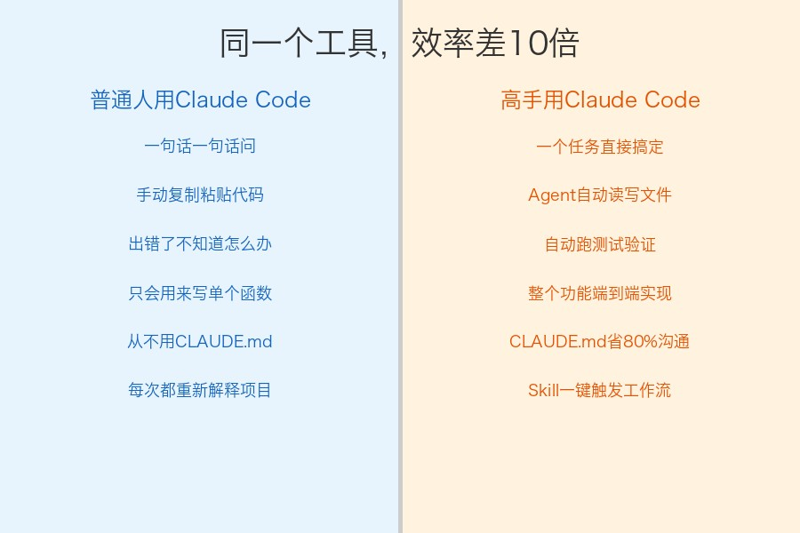
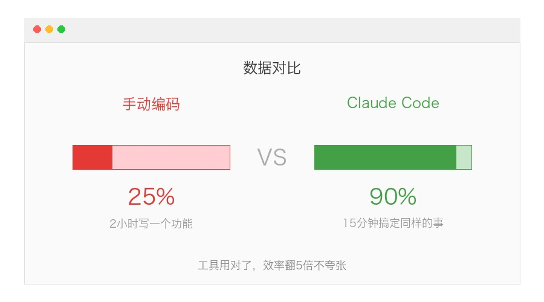

# Claude Code 使用技巧：7个让你效率翻5倍的骚操作，90%的人都没用对

你是不是这样用 Claude Code 的：

打开终端，问它一个问题，它回答了，你复制粘贴到项目里，再问下一个问题。

然后遇到报错，把报错贴过去，它给你改了，你再手动贴回去。

**讲真，这样用 Claude Code 就像买了辆法拉利去买菜——能用，但暴殄天物。**

今天把我用了半年摸出来的 7 个技巧分享出来。每一个都是实操验证过的，不是官方文档的复读机。

## 技巧一：用 CLAUDE.md 让它"记住你的项目"

这是提效最明显的一个操作。

每次开新会话，Claude Code 不认识你的项目。你得花前5分钟重新解释"我用的是什么框架""文件结构是怎样的""代码规范是什么"。

**解决方案：在项目根目录放一个 `CLAUDE.md` 文件。**

它会在每次对话开始时自动加载，相当于给 Claude Code 一份"项目说明书"。

写什么进去：
- 项目的技术栈和架构概览
- 你的代码风格偏好（用 Tab 还是空格、命名习惯等）
- 常用命令（怎么跑测试、怎么构建、怎么部署）
- 你反复需要说明的上下文

写完之后，你会发现再也不用重复解释那些基础信息了。省下的时间，一天能多干两个需求。

## 技巧二：别一句话一句话问，给它完整任务

新手最常犯的错：把 Claude Code 当搜索引擎，一行行问。

"这个函数怎么写？"
"怎么加个参数？"
"帮我加个错误处理。"

三句话问完，你手动拼装了10分钟。

**正确做法：直接描述最终目标，让它一步到位。**

比如你别说"帮我写个函数"，你说：

> "给 user 模块增加一个批量导入功能：读取 CSV 文件，校验邮箱格式，去重，写入数据库，返回导入成功/失败的数量。用现有项目的代码风格。"

它会自动读你的代码、找到对应文件、按照项目风格生成完整实现、甚至帮你跑测试。

**你要做的不是拆解任务，是描述清楚你要什么结果。** 拆解任务是它的活，不是你的。

## 技巧三：让它自己跑测试验证

很多人写完代码就结束了。但 Claude Code 的真正杀手锏是：**它能自己跑命令验证。**

你可以在任务描述里加一句：

> "写完之后跑一下测试，确保没有 break 现有功能。"

它会：
1. 写完代码
2. 自动执行 `pytest` / `npm test` / 你项目里的测试命令
3. 如果测试挂了，自己看错误、修改代码、重新跑
4. 直到全部通过才告诉你"搞定了"

你喝口咖啡回来，功能写好了，测试也过了。这才叫自动化。

## 技巧四：用 /compact 保住你的上下文

Claude Code 有上下文窗口限制。聊久了之后你会发现它开始"忘事"——前面说过的约定不记得了，文件读过又要重新读。

**解决方案：用 `/compact` 命令手动压缩上下文。**

什么时候用：
- 一个任务完成后、开始下一个任务前
- 感觉它开始重复问你已经说过的东西
- 对话超过20轮以上

它会保留关键信息，清理掉中间过程的细节，给后续对话腾出空间。

配合 `CLAUDE.md` 用效果更好——即使上下文被压缩，`CLAUDE.md` 里的信息永远在。

## 技巧五：Skill 系统——把重复工作流变成一键触发

如果你发现自己反复让 Claude Code 做同一类事情（比如每次写完代码都要跑 lint、写测试、更新文档），那你应该把这个流程做成 Skill。

Skill 本质是一个 markdown 文件，放在 `.claude/skills/` 目录下，描述了一个完整的工作流程。

比如我有一个 `/article` Skill，一句话就能触发"采集爆款文章→分析规律→生成新文章"的完整流程。

**创建 Skill 的方法：**

1. 在项目根目录创建 `.claude/skills/你的skill名/SKILL.md`
2. 写清楚触发条件、执行步骤、输入输出
3. 之后每次说 `/你的skill名`，就会自动按流程执行

把那些你"每周都要手动做一遍"的事情 Skill 化，你会发现自己省下了大量重复劳动。

## 技巧六：Plan Mode——复杂任务先规划再动手

遇到大型重构、新功能设计这种事，别让它直接动手写代码。

**用 Plan Mode（规划模式），让它先出方案，你审批后再执行。**

怎么触发：在对话中说"先帮我规划一下方案"或者等它自动进入 plan mode。

Plan Mode 下它会：
- 读你的代码、理解架构
- 列出要改哪些文件、怎么改、有什么风险
- 等你确认后再一步步执行

这样做的好处：
- 避免它在错误的方向上写了一大堆代码你再推翻
- 你能提前发现方案里的坑
- 复杂任务拆分成可控的小步骤

**越大的任务，越值得先 Plan。**

## 技巧七：善用 Agent 并行——让多个子任务同时跑

Claude Code 可以启动"子Agent"来并行处理独立任务。

比如你要：
- 重构 A 模块
- 同时给 B 模块写测试
- 同时研究 C 库的用法

这三件事互不依赖，可以让它用 Agent 工具同时派三个子进程去做，结果汇总给你。

在实际使用中，当你说"帮我同时做这几件事"或者任务本身是并行的，它会自动用 Agent 模式。

**一个人的效率，顶一个小团队。** 这不是夸张，是真的。

## 额外彩蛋：3个你可能不知道的小功能

**1. 自动记忆（Auto Memory）**

Claude Code 可以在 `~/.claude/` 目录下记住跨会话的信息。你让它"记住这个"，下次新对话它还知道。

**2. Hooks（钩子）**

你可以配置 shell 命令在特定事件时自动执行。比如每次它编辑文件后自动跑 lint，或者每次提交前自动检查。

**3. 定时任务（Cron）**

在当前会话里可以设置定时触发的 prompt。比如"每5分钟检查一下构建状态"——适合等 CI 跑完的场景。

## 写在最后

Claude Code 不是一个"更高级的 ChatGPT"，它是一个**能直接操作你项目的编程搭档**。

用好它的关键就一句话：

**别把它当问答机器，把它当同事用。**

你不会跟同事说"帮我写第37行到第42行的代码"，你会说"这个需求你来做，做完跑一下测试"。

对 Claude Code 也是一样。给目标，不给步骤。它比你想象的能干。

你用 Claude Code 最提效的场景是什么？有什么独家技巧？

**评论区分享你的使用心得，看看大家都是怎么用的。**

觉得有收获的话，转给你身边还在手动复制粘贴代码的朋友吧。
