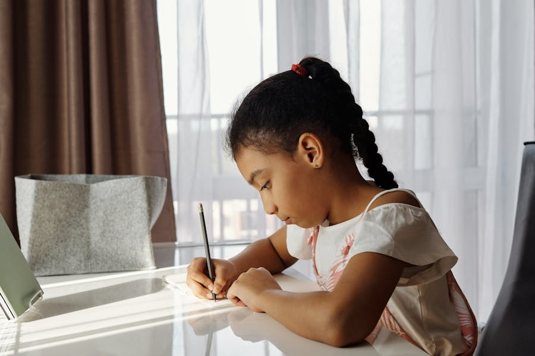
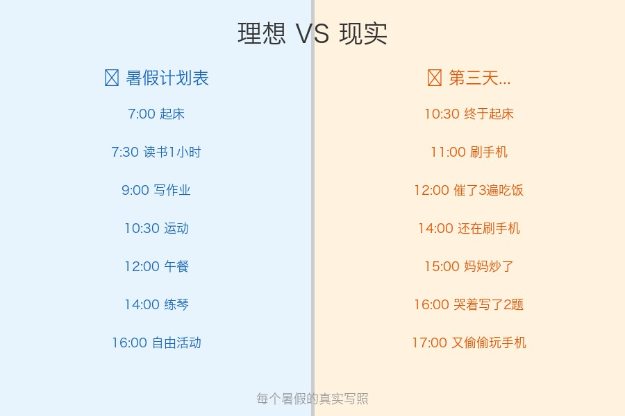
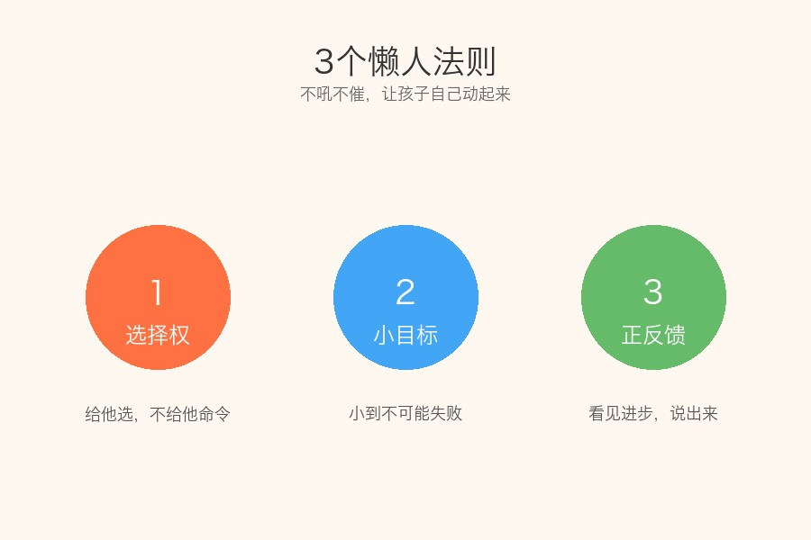
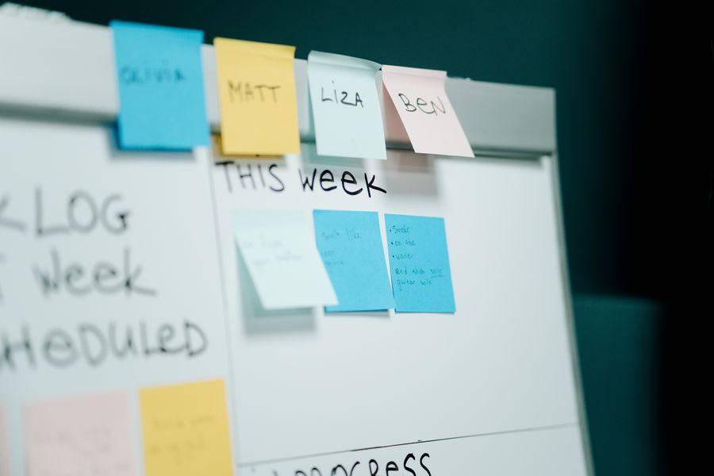
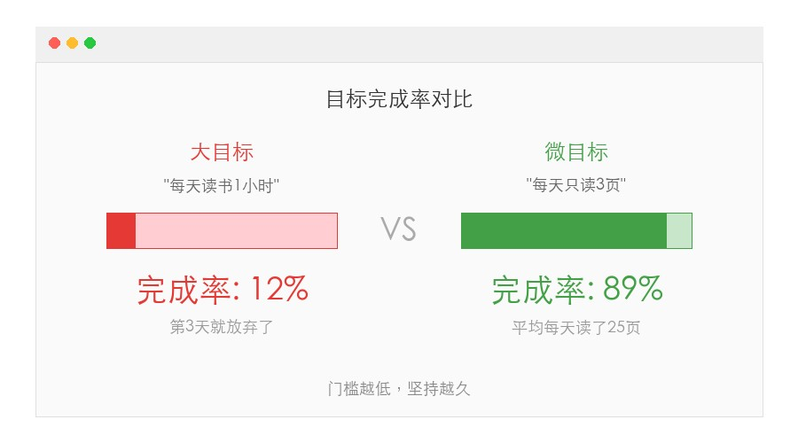

# 暑假想让孩子自律？90%的家长都用错了方法，试试这3个"懒人法则"

你有没有发现一个很奇怪的现象：

暑假刚开始，你精心制定了计划表，贴在墙上，打印得漂漂亮亮。

结果不到一周，孩子就开始赖床、拖延、打游戏停不下来。

你越催越烦，孩子越催越磨蹭。

**说实话，不是孩子不行，是我们用错了方法。**

## 为什么"计划表"不管用？

哈佛大学心理学教授丹尼尔·韦格纳做过一个实验：

你越告诉自己"不要想白熊"，脑子里就越全是白熊。

孩子也一样。你越规定"7点必须起床"，他越觉得7点是一种惩罚。

**真正的自律，从来不是靠外力推着走，而是让孩子自己想动起来。**

今天分享 3 个"懒人法则"，不吼不催，让孩子暑假自己动起来。

## 法则一：给孩子"选择权"，而不是"命令权"

朋友小雨跟我吐槽，她每天早上喊儿子起床像打仗。

后来她换了个方法：

不再说"7点必须起来"，而是问：**"你想7点起还是7点半起？"**

孩子选了7点半。

神奇的是，从那以后，闹钟一响，他真的自己爬起来了。

为什么？

因为这是**他自己的选择**，不是妈妈的命令。

心理学上叫"自主动机"——当一个人觉得"这是我决定的"，他执行的意愿会提高 3 倍以上。

**具体怎么做：**
- 起床时间：给2个选项让孩子选
- 作业顺序：先写数学还是先写语文？你来定
- 运动方式：跳绳还是骑车？你说了算

给选择，不给命令。孩子自己选的，他会自己守。

## 法则二：目标小到"不可能失败"

你有没有发现，那些贴满墙的宏大计划，最后都死在了第三天？

不是孩子懒，是目标太大了，大到还没开始就觉得累。

我邻居家的小学生乐乐，暑假的目标不是"每天读书1小时"，而是：

**每天只读3页。**

3页，3分钟就读完了。

但你猜怎么着？他后来几乎每天都读了20-30页。

因为一旦开始了，惯性会带着他继续。

这就是"微习惯"的魔力——**门槛低到不好意思不做。**

**具体怎么做：**
- 读书：不要求1小时，只要求翻开书读3页
- 运动：不要求跑步30分钟，只要求穿上运动鞋出门
- 作业：不要求全部写完，只要求打开本子写第1题

开始了，就成功了一半。

## 法则三：看见进步，比纠正错误重要100倍

讲个真事。

我家孩子有天主动收拾了书桌。虽然收拾得乱七八糟，书摞歪了，笔筒也没归位。

我第一反应想说"你这摆的什么呀"。

但我忍住了，改成：**"哇，你今天自己收拾了！妈妈看到了。"**

从那天起，他每天都会收拾一下书桌。

虽然依然不完美，但越来越好。

**这就是"正反馈循环"**——你关注什么，什么就会变多。

你天天盯着孩子的问题说，他接收到的信号是"我不行"。

你天天看到他的小进步并说出来，他接收到的信号是"我可以"。

**具体怎么做：**
- 用"我看到了"代替"你应该"
- 每天找到1件孩子做对的小事，当面说出来
- 在冰箱上贴一张"进步墙"，每天记录一条小成就

## 写在最后

真正聪明的育儿，从来不是逼孩子，而是：

1. 给他选择权——让他觉得"这是我的事"
2. 把目标缩小——让他觉得"这太简单了"
3. 看见他的好——让他觉得"我真的可以"

**这三件事，今天就能开始用。不需要报班，不需要花钱，只需要你换一个"说话的方式"。**

暑假还长，别急。

用对方法，孩子会让你惊喜。

你家孩子暑假最让你头疼的是什么？

是起床？是作业？还是手机？

**评论区聊聊，看看大家的"暑假生存指南"都是什么样的。**

觉得有用的话，转给身边正在为暑假发愁的家长吧。
