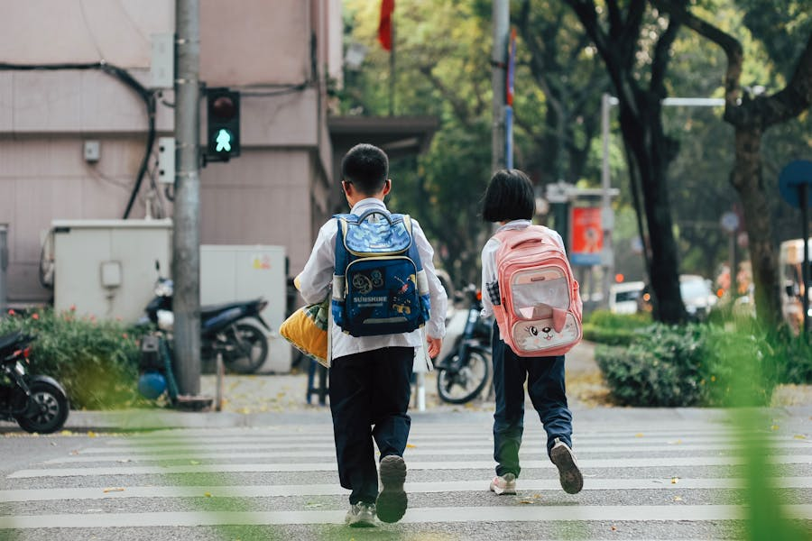
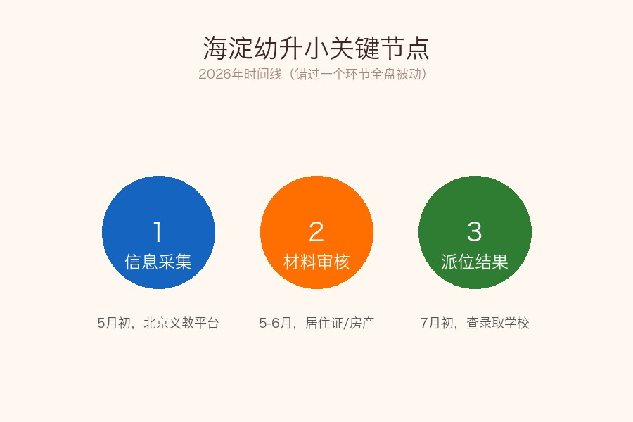
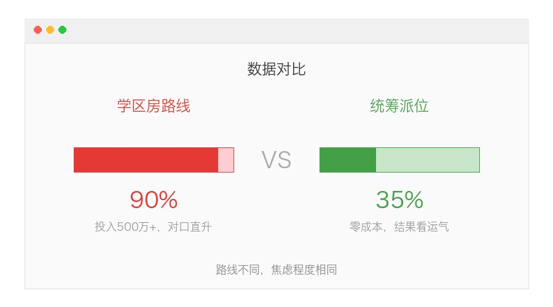
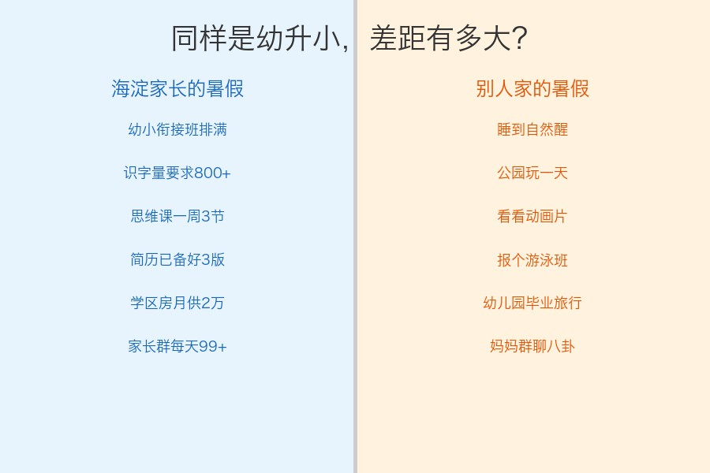
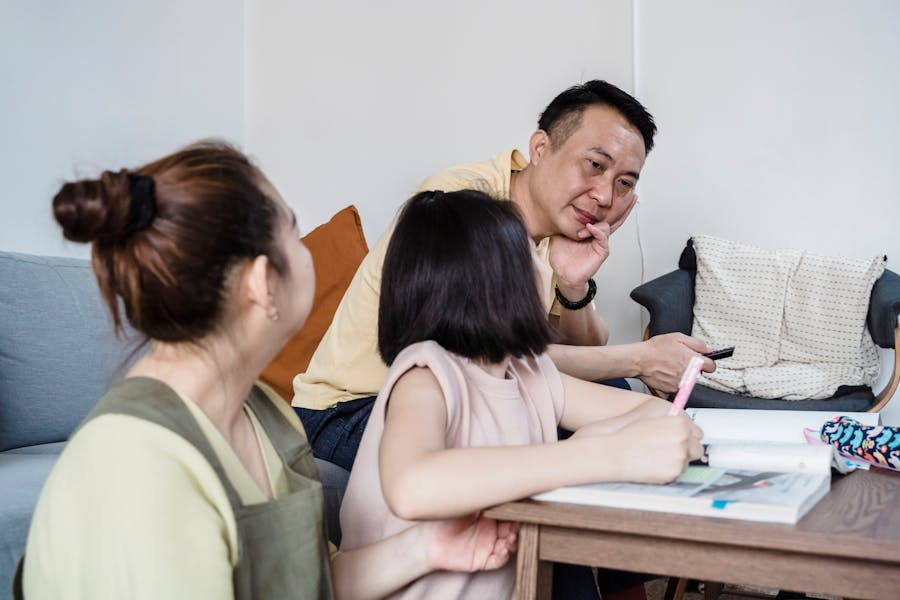

# 海淀幼升小：一场没有硝烟的战争，你准备好了吗？

你以为幼升小就是"到了年龄上学"这么简单？

在海淀，幼升小是一场从孩子3岁就开始倒计时的系统工程。

信息采集、材料审核、学区划片、派位摇号……每一个环节出错，都可能让你精心准备了三年的计划全盘崩塌。

**说句不夸张的：海淀幼升小，拼的不是孩子，是家长的信息差。**

## 2026年海淀幼升小，到底有多卷？

先看几个数据：

- 海淀2026年适龄入学儿童约**3.5万人**，比去年又增加了
- 热门学区（中关村、万柳、上地）供需比接近**3:1**
- 学区房均价12-18万/平，一套小两居动辄**700万+**
- 幼小衔接班报名，去年12月就已经满了

这意味着什么？

意味着你6月份才开始着急，已经晚了。

## 海淀幼升小的3条路线

根据你的资源和承受能力，大致分三条路：

### 路线一：学区房（确定性最高，成本最高）

核心逻辑：**用钱买确定性。**

- 对口直升优质小学（中关村一二三小、人大附小、翠微等）
- 需要提前1-3年落户，部分学校要求"房户一致"满3年
- 投入：500万-1000万（房产）+ 每年几万课外班

注意坑：
- 有些学区开始实行"多校划片"，买了房也不一定对口
- "房户一致"的年限要求每年可能变动
- 六年一学位政策，别买了才发现名额被占了

### 路线二：全区派位（成本最低，不确定性最高）

核心逻辑：**接受随机，降低焦虑。**

- 不买学区房，按实际居住地参与派位
- 可能被分到家门口的普通校，也可能运气好进片区内的优质校
- 投入：几乎为零（正常租房/自有住房即可）

但现实是：海淀的"普通校"放到其他区，可能也不差。别被焦虑绑架。

### 路线三：民办校 / 跨区择校

核心逻辑：**用钱+信息差换赛道。**

- 民办校：海淀几所优质民办（如北外附校等）可选，但学费不便宜
- 跨区：如果你在海淀有房但户口在其他区，需要研究跨区政策
- 投入：学费5-15万/年 + 额外交通成本

## 海淀家长和普通家长的差距

讲个真事。

我同事的孩子今年幼升小。她从孩子4岁开始：

- 每周三节思维课（火花、学而思轮着上）
- 识字量目标1000（用各种APP打卡）
- 提前学完了一年级上册数学
- 准备了3个版本的"儿童简历"
- 学区房看了一年多，最终在万柳咬牙买了套老破小

而另一个朋友，住在朝阳区，孩子同龄，暑假计划是——**"带孩子去海边玩一周"。**

我不评判谁对谁错。但这就是海淀的生态：**不是你想卷，是周围所有人都在卷，你不动就是退步。**

## 给海淀幼升小家长的5条实操建议

说完背景，来点干货。不管你走哪条路线，这5件事现在就该做：

**1. 信息采集别错过**

每年5月初开放北京义教入学服务平台，错过时间窗口就只能等补录。现在就去关注"海淀教育"公众号，别指望有人提醒你。

**2. 材料早准备，别等到审核时抓瞎**

海淀对非京籍的审核尤其严格：
- 居住证（或居住登记卡）
- 在京务工就业证明
- 全家户口簿
- 房产证明或租房合同+完税证明

任何一项材料有问题，直接影响入学。

**3. 实际居住地比户口更重要**

2026年海淀继续强化"以房定校"逻辑。你户口在海淀但实际住在昌平，不会按海淀安排。入学前至少半年，确保实际居住地与材料一致。

**4. 别迷信幼小衔接班，但基础储备要做**

海淀优质小学的实际教学进度确实快。建议：
- 识字量：认识500-800个常用字（不需要会写）
- 数学：20以内加减法熟练
- 习惯：能坐得住30分钟、能自己收拾书包

但别过度鸡——一年级的核心不是知识，是习惯。

**5. 心态建设：接受"够好就行"**

中关村三小和一个普通海淀公立校，6年后的差距远没有你想象的大。

真正决定孩子发展的，是家庭环境和阅读习惯，不是一个小学的名字。

## 写在最后

海淀幼升小确实卷，但别被焦虑冲昏头脑。

记住三句话：

1. **信息差是最大的成本**——别闷头使劲，先把政策吃透
2. **适合的才是最好的**——孩子开心、离家近、老师负责，比名校牌子重要
3. **小学只是起点**——6年后的中考才是真正的分水岭

焦虑可以有，但别让焦虑替你做决定。

你家孩子今年幼升小吗？走的哪条路线？

学区房？派位？还是民办？

**评论区说说你的选择和纠结，看看其他海淀家长是怎么抉择的。**

觉得有用的话，转给身边正在为幼升小焦虑的家长吧。
