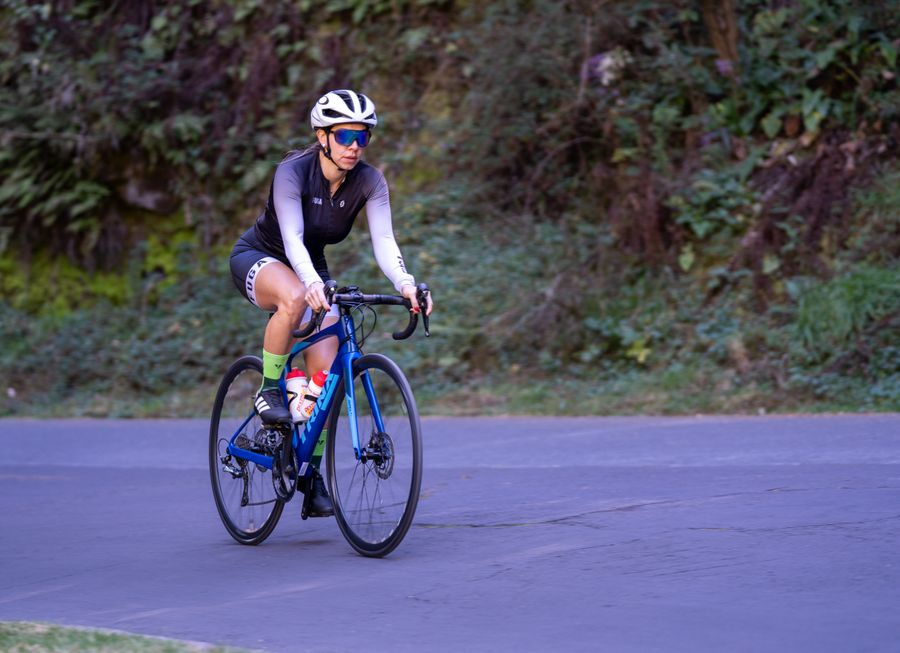
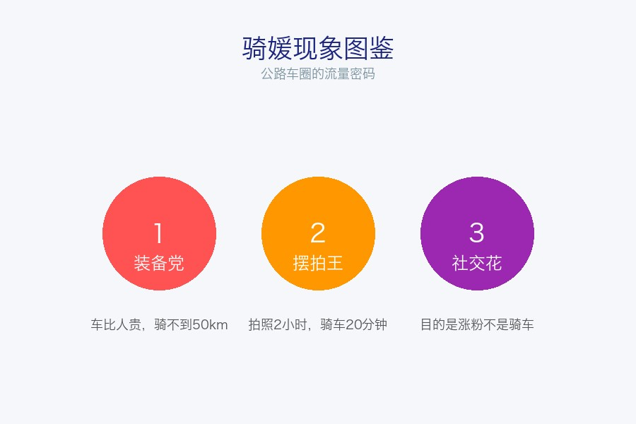
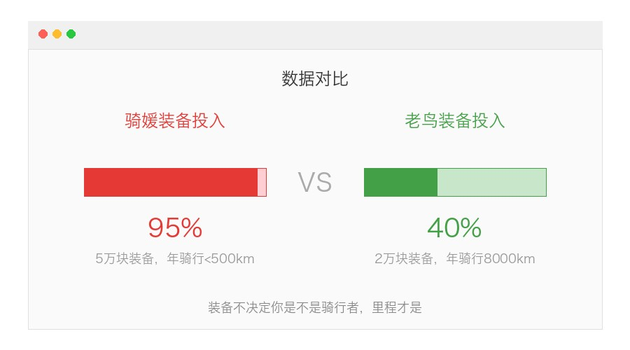
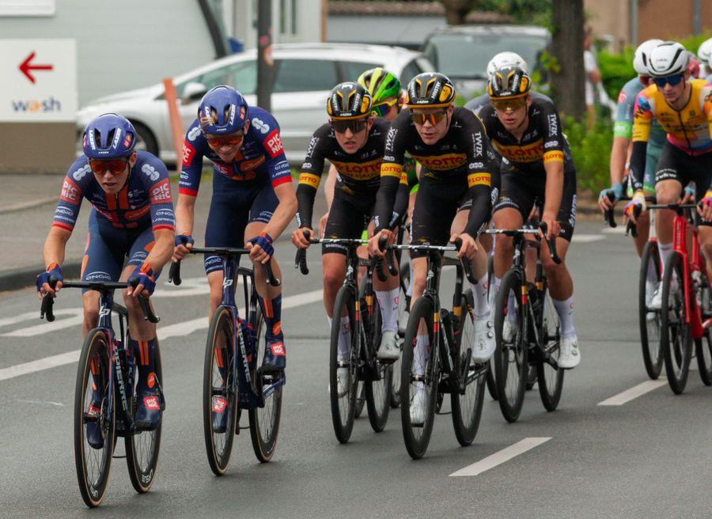

# 公路车圈的"骑媛"现象：是流量密码，还是骑行文化的入侵者？

你有没有注意到，最近公路车圈变了。

打开小红书，满屏都是穿着紧身骑行服、妆容精致、骑着万元公路车在咖啡店前摆拍的女生。

评论区清一色"求装备链接""姐姐好美""这是什么车"。

而真正骑了几千公里的老鸟看到这些，嘴角抽了抽，默默划走。

**"骑媛"这个词，就是这么来的。**

## 什么是骑媛？

先说清楚定义。

骑媛，指的是**以骑行为外壳、以社交媒体曝光为真正目的**的现象。

她们通常有几个共同特征：

- 装备极其昂贵（动辄3-5万的整车），但年骑行量不超过500公里
- 妆容精致到不像刚骑完车的人（因为确实没怎么骑）
- 内容重点不是路线、训练、感受，而是穿搭、摆拍、氛围感
- 经常出现在骑行团的队尾，或者干脆只在起点/终点出现

讲真，这不是骑行，这是cosplay骑行。

## 为什么骑媛越来越多？

说白了，三个字：**有钱赚。**

一个穿着紧身骑行服、骑着Specialized Tarmac在海边公路摆拍的美女，发到小红书上：

- 骑行服品牌找你合作
- 咖啡店请你来拍探店
- 骑行团请你当"氛围担当"
- 甚至自行车品牌会送车

你认真骑了3年、攒了2万公里的老哥，发个训练记录，点赞17个。

**这就是现实。流量不认公里数，只认颜值和氛围感。**

## 老鸟为什么反感骑媛？

不是吃醋，不是歧视女性骑行者。

真正让老鸟不爽的是这几件事：

**1. 安全隐患**

骑媛往往骑行技术不过关。跟团骑行时握不住下坡弯道、不会打手势、突然变道拍照，这些行为在公路上是真的会出事的。

摔车不是拍视频的素材，是骨折和皮肤移植。

**2. 歪曲了骑行文化**

当"公路车骑行"在大众认知里变成了"拍照好看的户外活动"，真正的骑行精神——坚持、突破、在痛苦中找到自由——就被稀释了。

新人进圈的第一件事不再是"选什么训练计划"，而是"穿什么颜色拍照好看"。

**3. 装备价格被炒上天**

当骑行变成社交货币，二手市场上的热门车型被炒到离谱。原本用来训练的工具，变成了身份标签。

## 但话说回来，也不用赶尽杀绝

我说句公道话。

不是所有穿得好看的女性骑行者都是骑媛。有的人就是既能骑得远、又能拍得美，人家凭什么不行？

**真正的区分标准不是性别，不是颜值，而是：你到底在不在骑。**

- 穿好看的骑行服，但真的骑完了100km的人——那是热爱生活的骑行者
- 全身装备万元，只为在咖啡店门口拍20张的人——那才是骑媛

而且客观来说，骑媛现象也带来了一些好处：

- 公路车从小众运动变成了大众话题，更多人关注到骑行
- 骑行装备市场扩大了，品牌有了更多研发投入
- 一部分"骑媛"后来真的爱上了骑行，从摆拍党变成了真骑行者

**所以问题不是"骑媛该不该存在"，而是"你是不是真的享受骑在路上的感觉"。**

## 给新入坑的朋友几句话

如果你是刚入公路车坑的新人，不管你是男是女：

1. **先骑起来，别先买装备**。2000块的二手车能让你知道自己到底喜不喜欢
2. **学会基本安全技能再上路**。变速、刹车、转弯、手势，这些比穿什么重要100倍
3. **里程会回答一切问题**。骑满1000公里之后，你自然知道自己需要什么装备
4. **拍照没问题，但别挡道**。路边摆拍注意安全，别在弯道和下坡停车

骑行圈很包容，不管你骑得快还是慢，大家尊重的是那份坚持。

但如果你买了5万块的车只是为了拍照——说实话，买个好相机可能性价比更高。

你身边有骑媛吗？你怎么看这种现象？

是觉得"人家花自己的钱，关你什么事"，还是觉得"真的影响了骑行环境"？

**评论区说说你的真实想法。**

觉得说得有道理的话，转给你的骑友群讨论一下。

