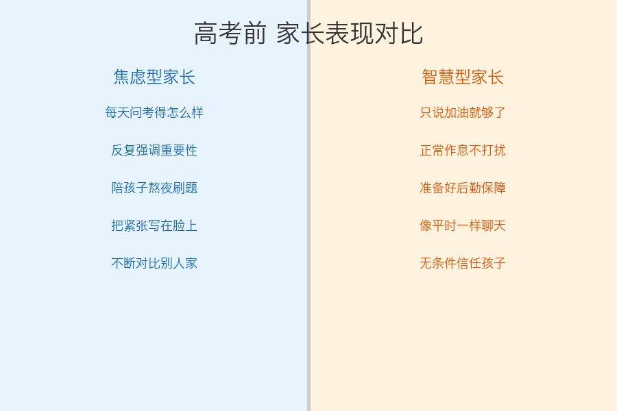
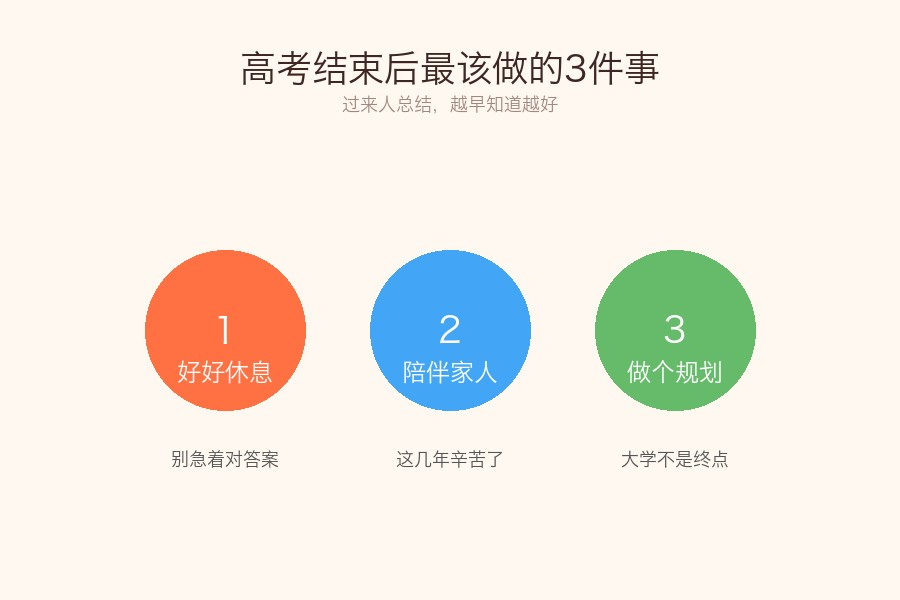
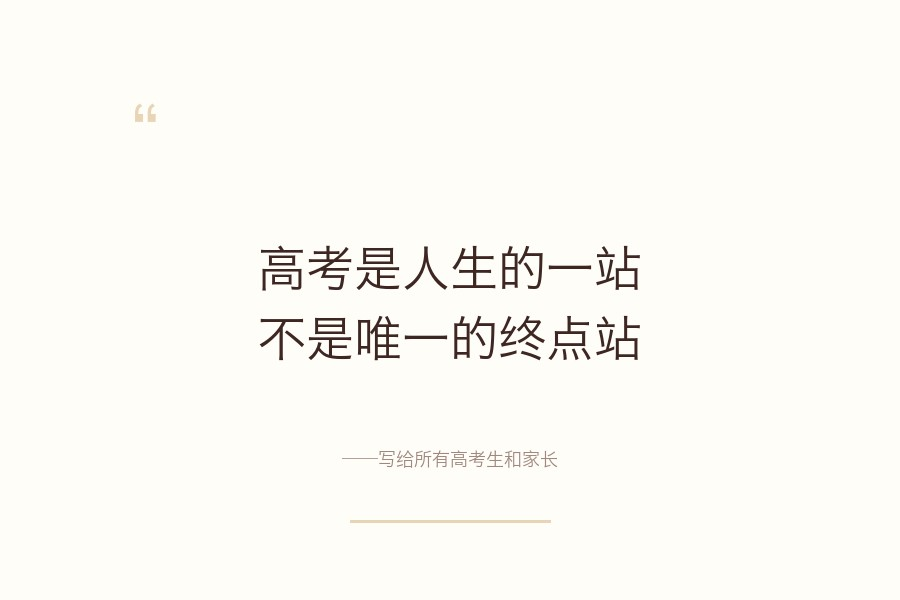
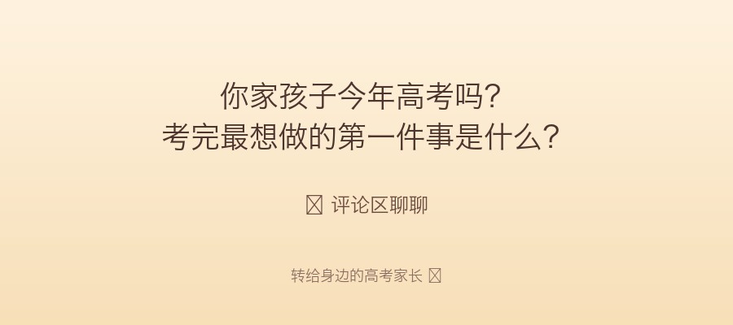

# 高考结束那一刻，比成绩更重要的3件事，90%的家长都忽略了

你有没有发现，每年高考一结束，朋友圈就分成两类人：一类忙着对答案、估分、焦虑；另一类，默默收起手机，带孩子吃了顿好的。

**后者的孩子，往往后来发展得更好。**

说实话，高考确实重要。但十几年的教育走到这一步，比那张分数单更重要的，是接下来你和孩子怎么度过这段"真空期"。

今天这篇，写给所有高考生的家长。不管考得好不好，这3件事，越早做越好。

## 第一件事：别问成绩，先说"辛苦了"

我一个朋友，孩子去年高考完回家，她就说了一句："妈给你炖了排骨汤，快洗手吃饭。"

没问考得怎么样，没提估分，也没急着讨论志愿。

后来孩子自己跟她说："妈，其实我出考场那一刻特别害怕回家，怕你们失望。结果你就跟没事人一样，我反而一下子就放松了。"

**孩子比你想象中更在意你的态度。**

那些考完就追着问"选择题选的啥""作文写的啥"的家长，本意是关心，但在孩子听来就是一句话："你考好了吗？"

这三年够累了。先让孩子喘口气，比什么都重要。

## 第二件事：别急着对答案，先做个"断联"

每年高考完，各种估分工具、答案解析满天飞。

讲真，对答案这件事，百害而无一利：

- 对了开心半天，等真正出分发现记错了，落差更大
- 错了焦虑好几天，影响后面填志愿的判断力
- 最关键的是——**你已经改不了任何一个答案了**

与其纠结一道选择题，不如带孩子出去走走。

我认识一位班主任，每年高考完都跟家长说同一句话：**"考完到出分这段时间，是你跟孩子关系修复的黄金期。"**

因为过去三年，大多数家庭的关系都紧绷到了极限。趁这段时间，一起吃饭、散步、看场电影，比对100道答案都有用。

## 第三件事：帮孩子想清楚一个问题——"大学想成为什么样的人"

注意，不是"考上什么大学"，是**"想成为什么样的人"**。

很多孩子到了大学就迷茫，不知道自己要什么，天天打游戏混日子。根本原因就是：高中三年只顾着刷题，从没想过这个问题。

高考完这段时间，是难得的思考窗口期。

你可以跟孩子聊聊：

- 这三年最有成就感的事是什么？
- 如果不考虑分数，最想学什么？
- 大学四年结束时，希望自己是什么状态？

**不用有标准答案，聊就够了。** 种下一颗种子，比报哪个志愿都重要。

---

高考是人生的一站，但绝不是终点站。

作为家长，我们能做的最好的事，不是帮孩子选一个"正确"的路，而是让他知道：**不管考成什么样，家永远是退路，也是出发的地方。**

说到底，孩子一辈子的路很长。高考只是开头几页，后面的章节，精彩着呢。

---

**你家孩子今年高考吗？考完最想做的第一件事是什么？**

评论区聊聊吧，转给身边的高考家长看看 ❤️
